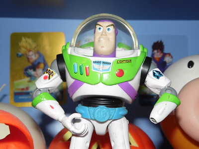

# Halloween - 2019

"Toy Story"

## Tools

#### Software

- [Inkcut](https://inkscape.org/~frmdstryr/%E2%98%85inkcut)

  An free and open source application for controlling 2D plotters, cutters, engravers, and 2D CNC machines. 

- [Inkscape](https://inkscape.org/)

  Inkscape is professional quality vector graphics software which runs on Linux, Mac OS X and Windows desktop computers.

#### Host

- Dell M6700
- [PopOS!_OS 18.04](https://system76.com/pop).

#### Hardware

- [hCNC3018](https://aliexpi.com/bkAp)
  - "Kit Build".
  - "15W" Laser.
- CNC6030
- [Silhouette Portrait](https://www.silhouetteamerica.com/shop/portrait) v1

## Source

- Buzz: https://www.flickr.com/photos/129764171@N07/15787181250
  - Voodoo Queen@flickr
  - Attribution-ShareAlike 2.0 Generic (CC BY-SA 2.0) 

(Original 5152x3864 used)

## Versioning Schema.

- Look at the trailing int.
- Largest int is the latest revision.